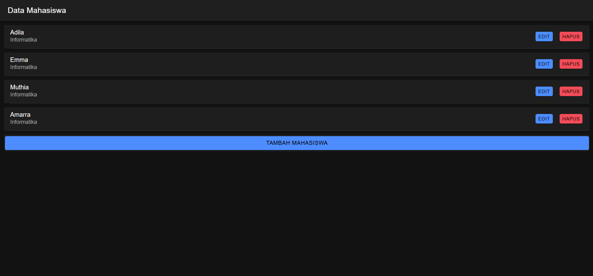
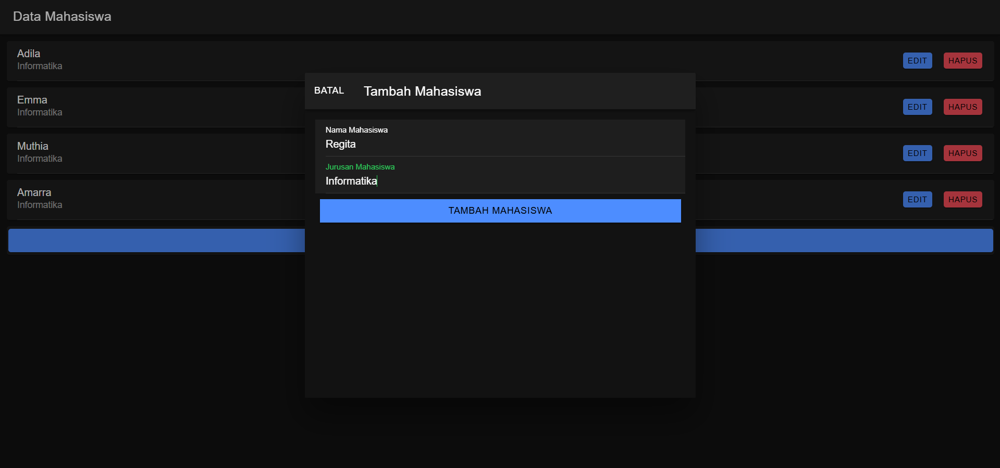
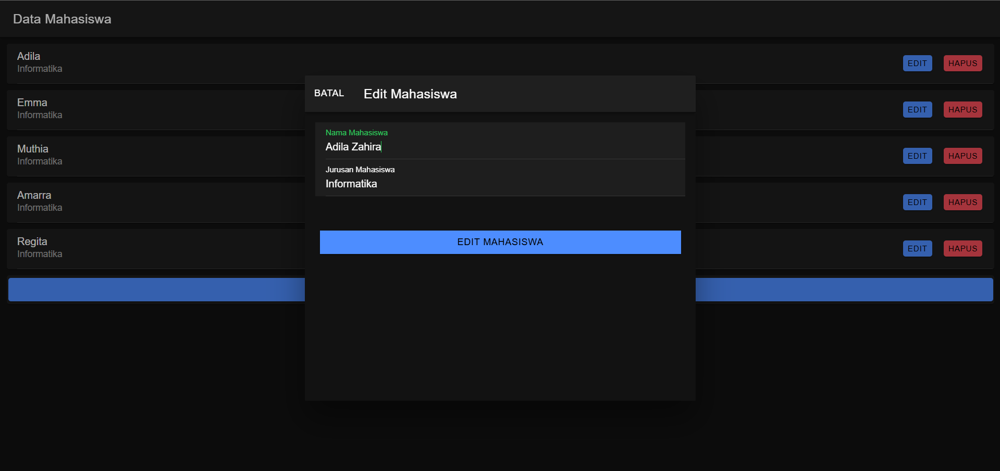
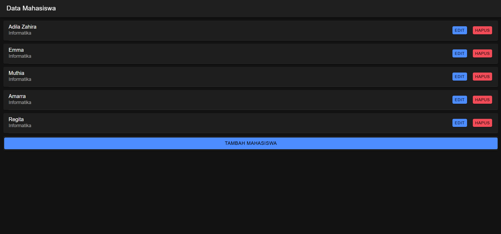

Tambah Mahasiswa (Create) dilakukan melalui modal tambah. Ketika tombol "Tambah Mahasiswa" ditekan, modal tampil, dan pengguna dapat mengisi nama dan jurusan. Data tersebut dikirim ke server melalui metode tambahMahasiswa(), yang memanggil API endpoint tambah.php menggunakan service ApiService. Setelah berhasil, modal ditutup, data di-reset, dan daftar mahasiswa diperbarui.

Edit Mahasiswa (Update) dimulai dengan menampilkan modal edit saat tombol "Edit" pada daftar mahasiswa ditekan. Data mahasiswa yang dipilih diambil dari server menggunakan metode ambilMahasiswa(). Setelah diedit, perubahan dikirim ke server melalui editMahasiswa() yang memanggil endpoint edit.php. Jika berhasil, modal ditutup, data di-reset, dan daftar diperbarui.

Hapus Mahasiswa (Delete) dilakukan saat tombol "Hapus" ditekan. Metode hapusMahasiswa() dipanggil, mengirimkan ID mahasiswa ke endpoint hapus.php. Jika penghapusan berhasil, data mahasiswa diperbarui tanpa memuat ulang halaman.

